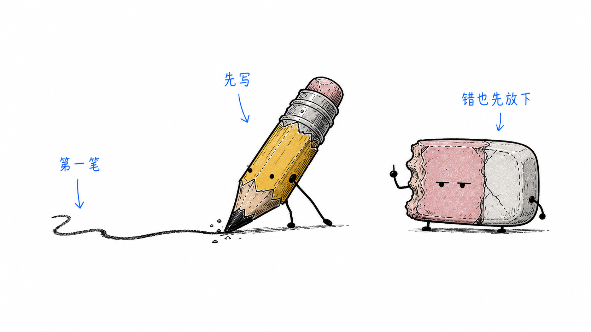
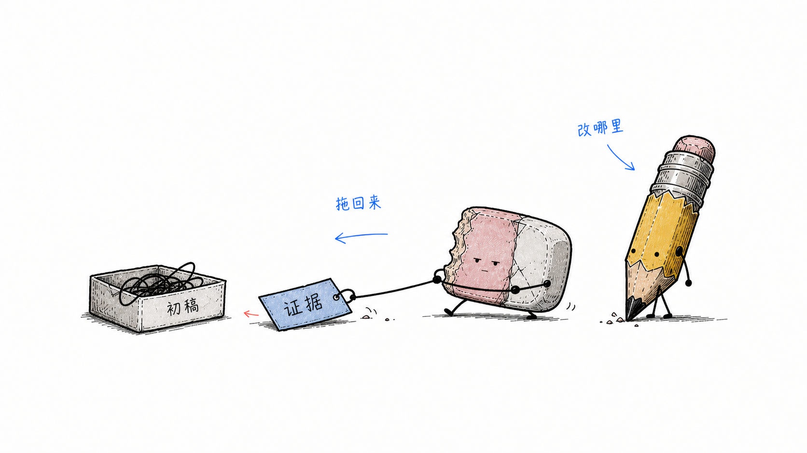
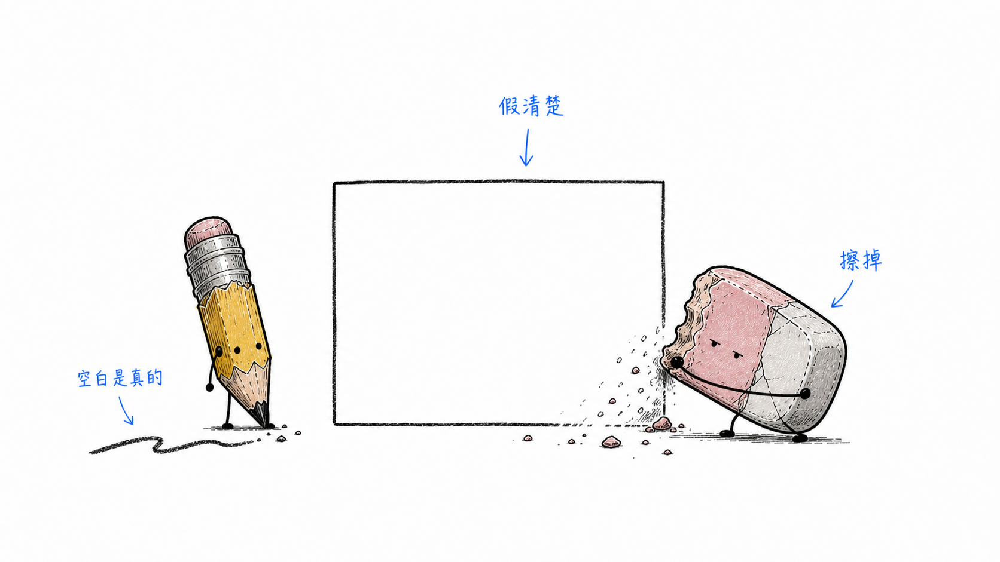
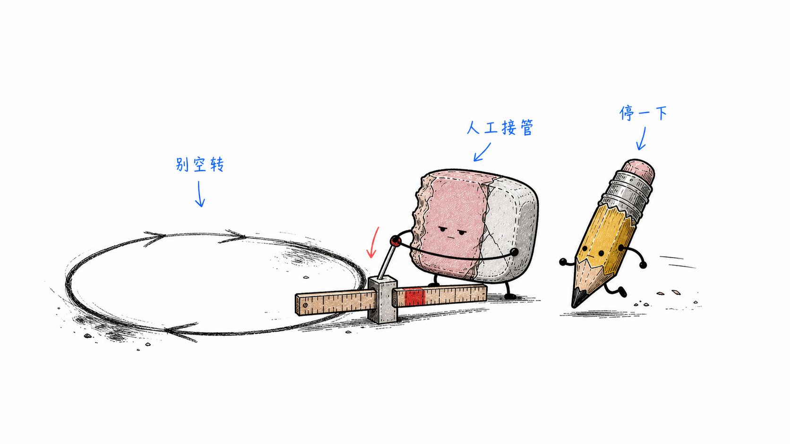
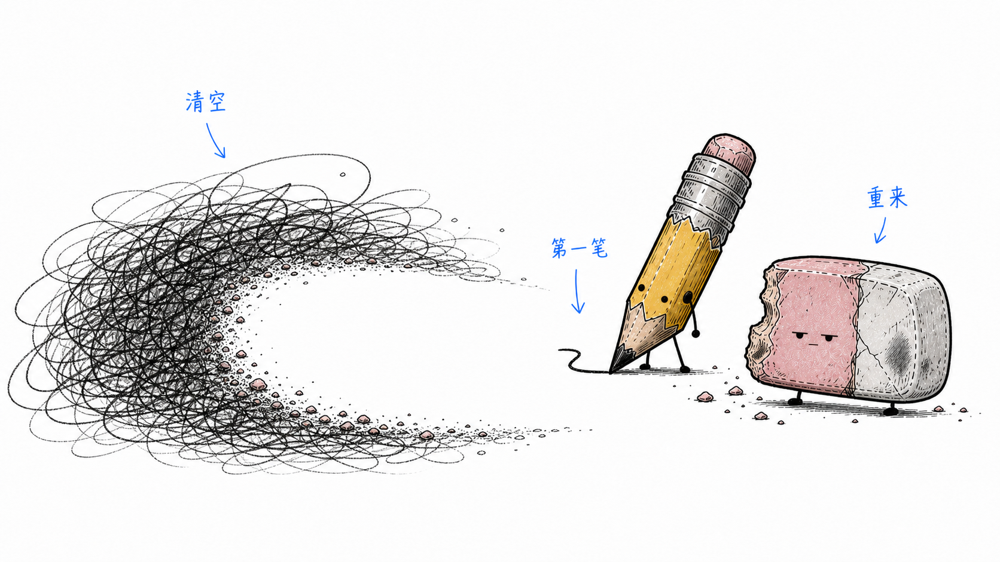
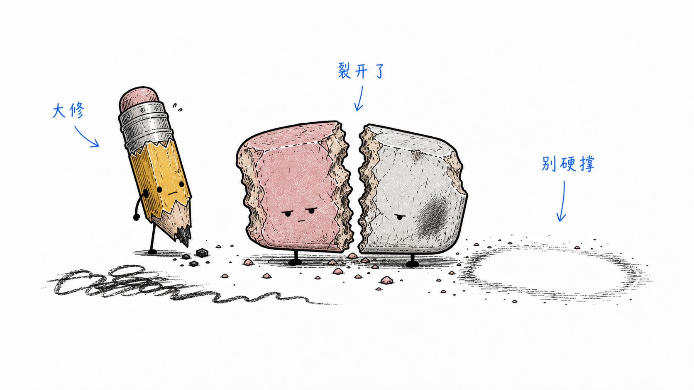
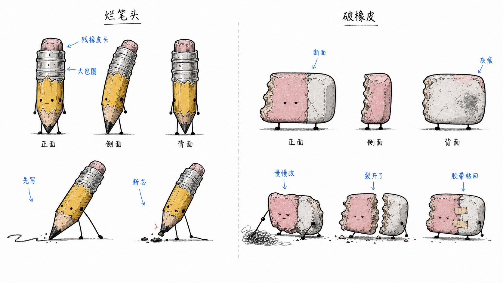

# Figthus

> 把中文文章里的认知锚点，变成一张张白底、手绘、残损文具感的正文配图。
>
> 16:9 横版 | 烂笔头 × 破橡皮 | 纯白手绘 | 少量红橙蓝中文批注 | Codex Skill

---

## 这个仓库是什么

Figthus 是一个 Codex Skill，用来指导 AI Agent 为中文文章、帖子、博客、Notion 文档和方法论内容生成正文配图。

它不是通用插画 prompt，也不是 PPT 信息图模板。它的核心目标是：**先理解文章里的认知锚点，再把其中一个判断、流程、结构、状态或隐喻，变成一张有记忆点的手绘解释图。**

默认视觉 IP 是一对残损文具：

- **烂笔头**：负责先写、先错、先把混沌外化成痕迹。
- **破橡皮**：负责怀疑、擦改、校准、把假清楚擦出空白。

一句话：**不画知识点，画知识点里正在发生的那一下。**

---

## 适合谁用

特别适合：

- 写中文文章，需要正文配图和文章插图的人
- 做知识型内容、方法论内容、AI 工作流内容的人
- 想把抽象判断画成具体认知动作的人
- 想要一种比 PPT 信息图更轻、更怪、更有个人识别度的配图风格的人
- 用 Codex 做内容生产，希望稳定复用一套视觉语言的人

不适合：

- 想要商业插画、品牌 KV 或精致扁平插画的人
- 想要传统 PPT 信息图、复杂架构图或流程图的人
- 想要儿童文具、可爱 IP、表情包风格的人
- 想把大量正文、长段解释或完整课程页塞进一张图里的人
- 需要严格可编辑矢量源文件的人

---

## 它会产出什么

默认输出：

- 16:9 横版正文配图
- 一篇文章的 4-8 张 shot list
- 每张图的主题、认知锚点、核心意思、可视动作、出场角色和中文标注建议
- 最终 PNG 图片，保存到 workspace 的 `assets/<article-slug>-figthus/`

默认不输出：

- PPTX / PDF / Keynote
- SVG / HTML / Canvas 可编辑图
- 商业海报或封面 KV
- 大段文字型信息图

---

## 视觉风格

Figthus 默认使用“残损文具认知草图”风格：

- 纯白背景，不要纸纹、米色、阴影、渐变
- 黑色手绘线稿，细线，轻微抖动
- 大量留白，主体只占画面约 40%-60%
- 少量红色、橙色、蓝色中文手写批注
- 一张图只表达一个核心认知动作、结构、状态或隐喻
- 烂笔头和破橡皮不必每张图同时出现；出场角色必须承担动作，未出场的一方可以通过铅笔线、擦痕、灰屑、空白、断芯或证据单在场
- 怪诞、低微、丑萌、清爽，但不幼稚、不卖萌

---

## 示例图库

这些是 Figthus 原生正文插图示例，不是角色设定稿。每张图只压住一个认知动作。

### 第一笔推出去



### 证据拖回来



### 假清楚被擦掉



### 停止闸



### 从空白重启



### 裂开了



## IP 设定

当前角色基准图：



完整设定见 [docs/ip-design/lanbitou-poxiangpi-ip.md](docs/ip-design/lanbitou-poxiangpi-ip.md)。

这张设定图只用于校准角色形象，不是正文插图示例。

---

## 安装

克隆仓库：

```bash
git clone https://github.com/rv198-star/Figthus.git
cd Figthus
```

复制 skill 到 Codex skills 目录：

```bash
mkdir -p "${CODEX_HOME:-$HOME/.codex}/skills"
cp -R ./figthus "${CODEX_HOME:-$HOME/.codex}/skills/"
```

安装后，在 Codex 里使用：

```text
Use $figthus 为这篇中文文章设计并生成 5 张正文配图。
```

---

## 怎么用

### 只做配图规划

```text
Use $figthus 先不要生图。
请分析下面这篇文章哪里值得配图，输出 5 张左右的 shot list。
每张图写清楚：放在哪段后、主题、认知锚点、可视动作、哪个角色出场、未出场角色留下什么痕迹、建议中文标注词。

<粘贴文章>
```

### 直接生成正文配图

```text
Use $figthus 把下面这篇文章生成 4 张正文配图。
要求：16:9 横版、纯白背景、黑色手绘线稿、少量红橙蓝中文手写批注。
每张图只讲一个认知动作，不要做 PPT 信息图，不要儿童文具海报。

<粘贴文章>
```

### 为单个概念生成一张图

```text
Use $figthus 为“结果要带着证据回来，而不是让 AI 原地多试几次”生成一张正文配图。
画面要怪诞但清爽，烂笔头负责推出第一版，破橡皮负责拿证据判断改哪里。
```

### 去掉图里的标题或错误文字

```text
Use $figthus 帮我编辑这张图，去掉左上角的“流程图”标题，其他内容保持不变。
```

更多示例见 [examples/prompts.md](examples/prompts.md)。

---

## 工作流程

这个 skill 的流程是：

1. 读取文章、Markdown、Notion 内容、截图或用户给的主题
2. 提炼核心观点、认知转折、流程结构和适合视觉化的段落
3. 先输出 shot list：每张图只选一个认知锚点
4. 把抽象概念换成可视动作
5. 为每张图选择结构类型：推出第一版、擦掉假清楚、证据回流、停止规则、重启空白、并行修正或失败分类
6. 重新发明一个低科技、怪诞但成立的物理隐喻
7. 选择出场角色：可以双角色同屏，也可以只让烂笔头或破橡皮单独承担核心动作
8. 每张图单独调用图像模型生成
9. 按 QA checklist 检查：白底、留白、出场逻辑、残损状态、短中文标注、非 PPT 感、非旧案例复刻
10. 保存最终 PNG，并报告用途和路径

---

## 目录结构

```text
.
├── README.md
├── LICENSE
├── NOTICE.md
├── assets/
│   └── pencil-eraser-ip-design/
├── docs/
│   └── ip-design/
├── examples/
│   ├── images/
│   └── prompts.md
├── figthus/
│   ├── SKILL.md
│   ├── agents/
│   │   └── openai.yaml
│   ├── assets/
│   │   ├── examples/
│   │   ├── reference/
│   │   └── legacy-xiaohei-examples/
│   └── references/
│       ├── style-dna.md
│       ├── ip-character.md
│       ├── composition-patterns.md
│       ├── prompt-template.md
│       └── qa-checklist.md
└── legacy/
    ├── origin/
    └── xiaohei-examples/
```

真正需要安装到 Codex 的是子目录：

```text
figthus/
```

根目录的 README、LICENSE、NOTICE、docs、assets 和 examples 是 GitHub 分享与开发文档。

---

## 注意事项

- 先选认知动作，不画概念名词。
- 图片里的中文文字越短越稳定。
- 每张图只讲一个核心结构，不要把文章做成说明书。
- 烂笔头和破橡皮不是必须同时出场；如果只出现一个角色，画面里也要有另一种力量留下的痕迹。
- 如果去掉出场角色画面仍然完全成立，说明角色太装饰了。
- 角色设定图只用于校准形象，不要复刻构图。
- 上游小黑示例只作为 legacy 来源材料，不是 Figthus 示例图库。
- AI 图像模型可能出现错字、幻觉标签、风格漂移或多余标题，生成后需要检查。
- 如果中文错字严重，优先减少标注词并重生成。

---

## Origin / Attribution

Figthus forked and adapted the structure and method spine of [Ian Xiaohei Illustrations](https://github.com/helloianneo/ian-xiaohei-illustrations), an MIT-licensed Codex Skill by Ian.

The original MIT license is retained in [LICENSE](LICENSE). See [NOTICE.md](NOTICE.md) for retained legacy assets and provenance notes.

---

## License

MIT License. See [LICENSE](LICENSE).
